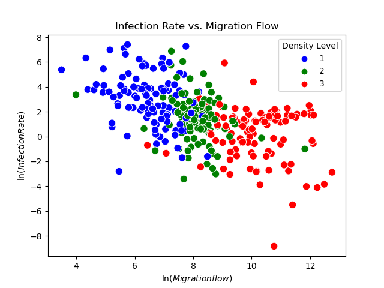

# Project 1

Course: CHE 2410 SEC1030 MATHMTCL METHD IN CHMCL ENGR 1

Instructor: Jason Shoemaker, PhD.

Student: Victoria Valentina Beltrán.

__Regression tools applied for COVID data analysis__

This repository contains an investigation into the relationship between migration rates, population density, and COVID-19 infection rates at a county level. The primary objective is to determine if a statistically significant correlation exists between these variables. 

Florida and Texas were chosen for this analysis, encompassing all of their counties. This choice was made considering that Florida is one of the states with substantial migration. Florida has a significant migrant population, especially in cities like Miami, which has a strong Cuban-American presence. Additionally, Texas, being close to Mexico, presents an interesting case for migration analysis. The state's proximity to Mexico has historically led to a significant flow of immigration, contributing to the state's diverse cultural landscape. Contrasting this with population density becomes intriguing as Texas is one of the most populous states in the U.S., making it an attractive region to study migration trends.

## Overview

The COVID-19 pandemic has raised questions about the factors contributing to the spread of the virus at a local level. Two variables of personal interest are gross migration and population density, as they may impact the transmission and infection rates of the virus. The drive to delve into factors like migration is rooted in the understanding that, as part of the migrant community, we encounter a multitude of challenges in our quest to adapt and thrive in a new environment. Among these challenges, one significant aspect is our vulnerability to diseases endemic to the new destination's environment, or the inadvertent importation of such illnesses. This project delves into the data to better understand the relationships between these variables.

## Data Sources

The analysis uses data from:

- COVID-19 cases by county (2020) obtained from: https://github.com/nytimes/covid-19-data/blob/master/us-counties-recent.csv
- Migration flow data (2016-2020), obtained from: [CENSUS.gov](https://www.census.gov/)
- Population density data (2020), obtained from: https://covid19.census.gov/

## Methodology

The measurement was calculated based on the formula'r_i = #\frac{cases}{county population}'. Upon initial data examination, a significant dispersion was observed. To address this, the natural logarithm of the data was taken, and the data was subsequently visualized, categorized by population density.
classifying the data into three categories with an equal number of data points to ensure that each group was representative. 

Then, in order to test the null hypothesis posed, a linear regression analysis was performed to assess the statistical significance of the factors we are evaluating concerning the response variable. This was done without assessing the combined effect of parameter interactions but, rather, initially examining the effect of each one individually.

Subsequently, a linear regression analysis was conducted, this time incorporating the interaction parameter between factors, and finally, a group analysis was conducted to understand how the factors influence the variable of interest within different subsets or data categories.

## Results

The data can be observed in the following graph:

Among the independent variables, "mf" (Migration Flow) and the intercept (const) are found to be highly significant, with low p-values, implying their strong influence on "roi." The "density_level" variable, while not as statistically significant (p-value = 0.077), may still have some impact

Individually, both "mf" and "density_level" show significant negative coefficients, suggesting that increases in these variables are associated with a decrease in "roi." The interaction term's coefficient is positive but statistically insignificant (p-value = 0.102), indicating a potential interaction effect that requires further investigation. In summary, these results illustrate the complex interplay between "mf" and "density_level" in influencing "roi," with the model explaining a substantial portion of the variation in the response variable. Further research may be needed to understand the full implications of the interaction term.

## Conclusions

In light of the null hypothesis that posited "the migration flow and density population do not affect the rate of covid infection" the results from our OLS regression analyses provide some insights. From the first analysis, examining the individual effects of the migration flow and population density on the rate of infection, demonstrated that these factors indeed have a statistically significant impact, contrary to our null hypothesis. The negative coefficients for both factors indicate that they do influence the infection rate.

In the second analysis, where was introduced the interaction term between the migration flow and the population density, the model's overall statistical significance suggests that there is an effect of these combined factors on the rate of infection. While the interaction term itself was not statistically significant, indicating that the interaction is less straightforward, the significance of the model as a whole implies that these factors do collectively affect the infection rate. 

In summary,these findings reject the null hypothesis that "migration flow and density population do not affect the rate of covid infection." Instead, this analysis supports the idea that these factors play a role in influencing the infection rate, emphasizing the need for a more nuanced and comprehensive understanding of these relationships.

